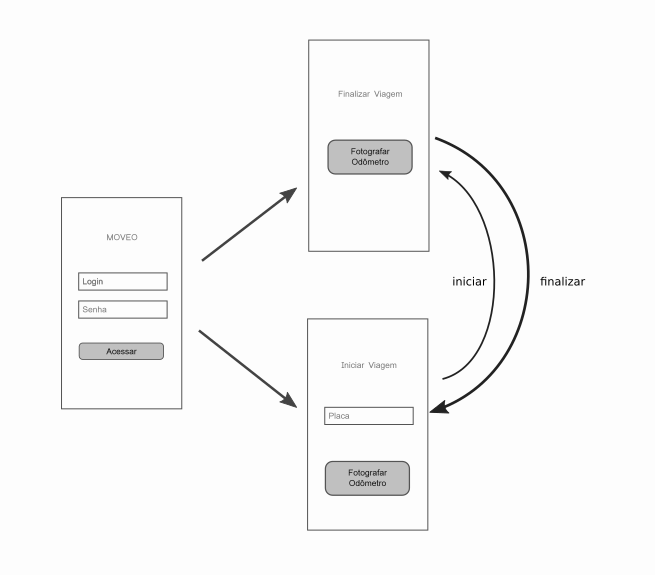

## moveo | mobile app

Use React Native.



### User Stories
- As a user I can log into the app with my credentials.
- As user I can press start to begin a trip.
    - The start button is enabled once I enter a licence plate
    - Clicking the start trip button opens a camera app.
- As user can press finish to end a trip.
    - Clicking the finish trip button opens the camera app.

### Behaviour

#### Login Screen
- The screen is not displayed if the user has logged in before.
- The redux state is saved and restored to localStorage.

#### Main Screen
- The first time a user logs in, the app initializes redux store, storing his login.
- The main screen displays a start trip button and an input field for a car plate.
- The start trip button is only enabled if the user has typed a car plate.
- If there is an ongoing trip, the app displays an end trip button instead.

#### Syncing

The app should upload finished trips to the backend once connectivity is acquired.

#### Redux

The app persists and restores the redux state from local storage.

The names of fields must be as documented below for easy serialization and deserialization on the backend.

```
[login]:{
    trips:{
        [tripId]:{
            plate
            start:{
                latitude,
                longitude,
                localPicPath,
                time
            },
            finish:{
                latitude,
                longitude,
                localPicPath,
                time
            }
        }
    }
```

#### Start and End Trip

After the user takes a picture, the app stores the picture locally and updates the redux state with information.

Example:

```
'joao.silva':{
    trips:{
        '339cdd3b-1746-479d-ac22-4b40a6e5c4a4':{
            plate:'FGS-3344'
            start:{
                latitude: 0.23327753,
                longitude: -0.2566941,
                time: 112351231,
                localPicPath:'/path/to/picture1.jpg,
            }            
        }
    }
}
```

A trip is finished if it both `start` and `finish` are filled. Example:

'joao.silva':{
    trips:{
        '339cdd3b-1746-479d-ac22-4b40a6e5c4a4':{
            plate:'FGS-3344'
            start:{
                latitude: 0.23327753,
                longitude: -0.2566941,
                time: 112351231,
                localPicPath:'/path/to/picture1.jpg,
            },
            finish:{
                latitude: 0.23322345,
                longitude: -0.2562231,
                time: 112355423,
                localPicPath:'/path/to/picture2.jpg,
            }   
        }
    }
}
```

`localPicPath` should be removed before sending to the backend.

### Requirements
- The app will only run if the user grants location, storage and camera usage permissions.
- The user must finish a previous trip before starting a new one.
- The app will save pictures and trip data locally and upload to backend if network is available.
- All code and comments in English.
- All strings displayed on the UI must be ready for localization.
